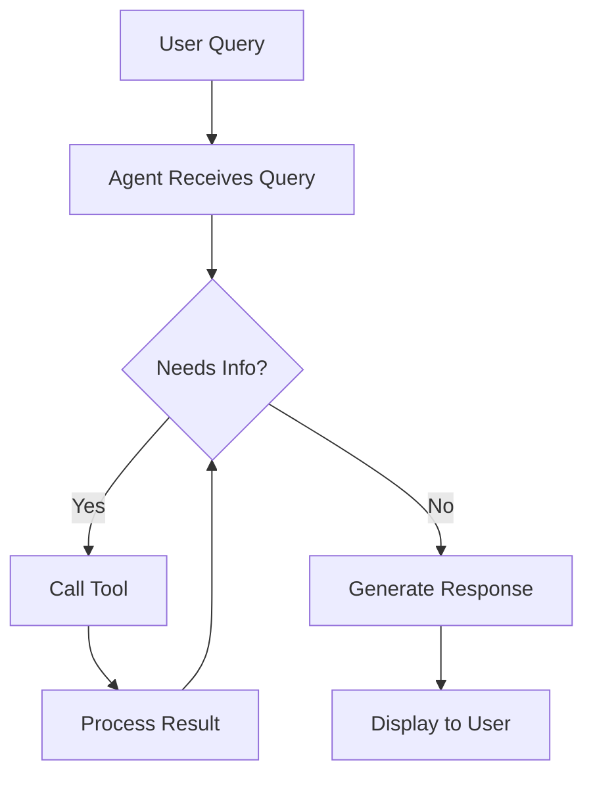

# AI Agent System

## Overview

The AI Assistant has been transformed into a **true autonomous AI agent** that can execute actions, query system state, and perform multi-step tasks. Instead of just generating Docker Compose files, the agent can now interact with your entire infrastructure.

## Capabilities

### 🔍 Infrastructure Query
- List all Docker hosts and their metrics
- Get detailed host information
- View container status and logs
- Monitor resource usage across the system
- Search for specific deployments

### 🚀 Deployment Management
- Deploy Docker Compose stacks to specific hosts
- Stop, restart, or remove deployments
- Get deployment status and logs
- Automatic host recommendation based on resources

### 📊 Monitoring & Metrics
- Real-time system metrics aggregation
- CPU, RAM, disk usage across all hosts
- Container and port usage statistics
- Resource-based recommendations

### 🛠️ Actions & Automation
- Execute multi-step workflows
- Troubleshoot deployment issues
- Automatic port conflict resolution
- Smart host selection for deployments

## Architecture

### Agent Components

1. **Agent Tools** (`src/services/ai/agent-tools.ts`)
   - Defines available functions the agent can execute
   - Tools for host management, deployments, containers, metrics
   - Each tool has a clear description and parameter schema

2. **Agent Orchestrator** (`src/services/ai/agent-orchestrator.ts`)
   - Main reasoning loop: Think → Act → Observe → Repeat
   - Manages conversation history and context
   - Parses agent responses to extract actions
   - Executes tools and processes results

3. **API Routes** (`src/app/api/ai/agent/route.ts`)
   - POST `/api/ai/agent` - Chat with the agent
   - GET `/api/ai/agent/tools` - List available tools

4. **UI Components** (`src/components/features/ai-assistant-content.tsx`)
   - Visualizes agent thinking process
   - Shows tool calls and results
   - Displays agent reasoning steps
   - Maintains conversation history

## Available Tools

### Host Management
- `list_hosts` - Get all hosts with status and metrics
- `get_host_details` - Detailed information about a specific host

### Deployment Management
- `list_deployments` - List all deployments (with optional filters)
- `deploy_compose_file` - Deploy a stack to a host
- `stop_deployment` - Stop a running deployment
- `restart_deployment` - Restart a deployment

### Container Management
- `list_containers` - List containers on a host
- `get_container_logs` - Get logs from a container

### Metrics & Monitoring
- `get_system_metrics` - Aggregated metrics across all hosts

### Helper Functions
- `suggest_host_for_deployment` - Recommend best host for deployment
- `search_deployments` - Search deployments by name

## Agent Workflow



### Example Interaction

**User:** "What's the status of my infrastructure?"

**Agent Process:**
1. **Thinking:** "I need to get the list of hosts and their metrics"
2. **Tool Call:** `list_hosts()` → Returns host data
3. **Tool Call:** `get_system_metrics()` → Returns aggregated metrics
4. **Response:** "You have 4 hosts online with an average CPU usage of 35%..."

## Agent Response Format

The agent uses a structured format for communication:

### Thinking
```thinking
I need to check the host status first, then look at the deployments...
```

### Tool Call
```tool
{
  "tool": "list_hosts",
  "parameters": {}
}
```

### Final Response
```response
Based on your infrastructure, here's what I found...
```

## UI Features

### Agent Steps Visualization
- 💡 **Thinking** - Shows agent's reasoning process
- 🔧 **Tool Calls** - Displays which tools are being used
- ✅ **Results** - Shows successful tool execution results
- ❌ **Errors** - Displays any tool execution failures

### Tool Usage Badges
Shows which tools were used in each response with small badges.

### Conversation History
Maintains full context of the conversation for multi-turn interactions.

## Example Queries

### Infrastructure Status
- "What hosts do I have?"
- "Show me the resource usage across all servers"
- "Which host has the most available resources?"

### Deployment Operations
- "Deploy PostgreSQL to my best server"
- "Stop the deployment called 'my-app' on host-1"
- "What's running on my raspberry-pi host?"

### Troubleshooting
- "Why is my deployment failing?"
- "Show me the logs for container nginx-1"
- "Which deployments are using port 3000?"

### Information Queries
- "How many containers are running total?"
- "What's the average CPU usage across my hosts?"
- "Find all deployments related to 'postgres'"

## Configuration

The agent uses your configured Ollama server (set in Settings):

```env
OLLAMA_SERVER_URL=http://10.10.10.216:11434
```

**Model:** Llama 3.2 (or any Ollama-compatible model)

## Adding New Tools

To add a new capability to the agent:

1. **Define the tool** in `agent-tools.ts`:
```typescript
{
  name: "my_new_tool",
  description: "What this tool does",
  parameters: {
    type: "object",
    properties: {
      param1: { type: "string", description: "..." }
    },
    required: ["param1"]
  },
  execute: async ({ param1 }) => {
    // Implementation
    return { result: "data" };
  }
}
```

2. The tool is automatically available to the agent
3. The agent learns to use it through the system prompt

## Technical Details

### Reasoning Loop
- Maximum 10 iterations per query (configurable)
- Each iteration: Get action → Execute tool → Process result
- Stops when agent provides final response or hits max iterations

### Context Management
- Full conversation history maintained
- Tool results added to context
- Agent can reference previous actions

### Error Handling
- Tools return structured success/error responses
- Failures are shown to the agent for debugging
- Agent can retry or try alternative approaches

## Future Enhancements

Potential additions:
- Streaming responses for real-time updates
- Multi-tool execution in parallel
- Long-term memory/knowledge base
- Proactive monitoring and alerts
- Automated incident response
- Learning from user preferences

## Benefits

✅ **Autonomous Operation** - Agent can complete multi-step tasks  
✅ **Context-Aware** - Understands your infrastructure state  
✅ **Transparent** - Shows reasoning and actions taken  
✅ **Extensible** - Easy to add new capabilities  
✅ **Natural Language** - Conversational interface  
✅ **Action-Oriented** - Can actually execute operations  

## Comparison

### Before (Static AI)
- Could only generate Docker Compose files
- No awareness of system state
- No ability to execute actions
- Single-turn interactions

### After (AI Agent)
- ✅ Queries infrastructure status
- ✅ Executes deployments and management tasks
- ✅ Multi-step reasoning and planning
- ✅ Tool execution with feedback
- ✅ Conversational context
- ✅ Transparent decision-making

---

**The AI Agent represents a significant upgrade from a simple code generator to a fully autonomous infrastructure management assistant.**
